<div align="center">
<picture>
  <source media="(prefers-color-scheme: dark)" srcset=".github/brand/banner-night.svg">
  
</picture>
<br><br>
<a href="#about"><picture><source media="(prefers-color-scheme: dark)" srcset=".github/brand/tab-about-night.svg"></picture></a>
<a href="#how-it-works"><picture><source media="(prefers-color-scheme: dark)" srcset=".github/brand/tab-how-it-works-night.svg"></picture></a>
<a href="#quickstart"><picture><source media="(prefers-color-scheme: dark)" srcset=".github/brand/tab-quickstart-night.svg"></picture></a>
</div>

<p>
<a name="about"></a>
<picture><source media="(prefers-color-scheme: dark)" srcset=".github/brand/section-about-night.svg"></picture>
</p>

Briz points an LLM at a messy directory, has it read the file tree, and sorts everything into a logical structure — no hand-written rules, no regex matching on filenames.

```
briz ~/Downloads              → analyze and sort
briz ~/Downloads --dry-run    → preview the plan without touching anything
```

<p>
<a name="how-it-works"></a>
<picture><source media="(prefers-color-scheme: dark)" srcset=".github/brand/section-how-it-works-night.svg"></picture>
</p>

| Package | Role |
|---------|------|
| `internal/fileops` | Filesystem walking, moves, safety checks |
| `internal/llm` | Prompts an LLM with the directory tree, parses the sort plan |
| `internal/rules` | Loads `config/default_rules.yaml` as guardrails for the LLM |
| `internal/sorter` | Applies the plan — or just prints it under `--dry-run` |

<p>
<a name="quickstart"></a>
<picture><source media="(prefers-color-scheme: dark)" srcset=".github/brand/section-quickstart-night.svg"></picture>
</p>

```sh
git clone https://github.com/NoamFav/Briz && cd Briz
make install

briz ~/Downloads --dry-run   # see the plan
briz ~/Downloads             # apply it
```

<div align="center">

Made with ♥ by [NoamFav](https://github.com/NoamFav) · Apache 2.0

</div>

<br>

<a href="https://nf-software.com">
<picture>
  <source media="(prefers-color-scheme: dark)" srcset=".github/brand/footer-night.svg">
  
</picture>
</a>
